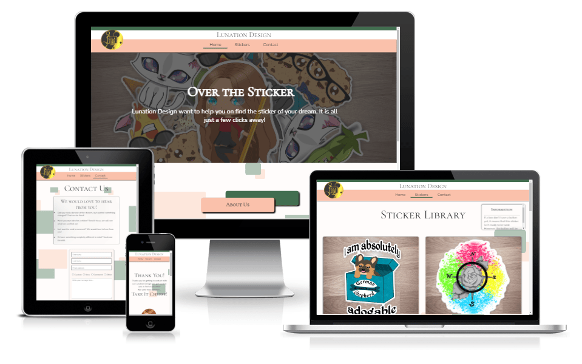
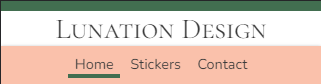
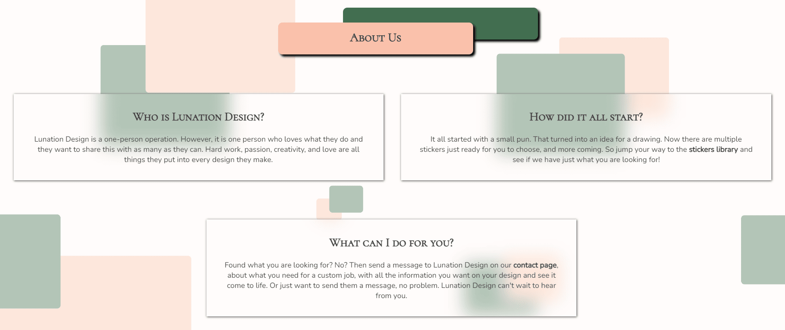
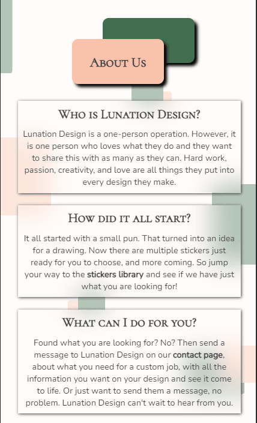
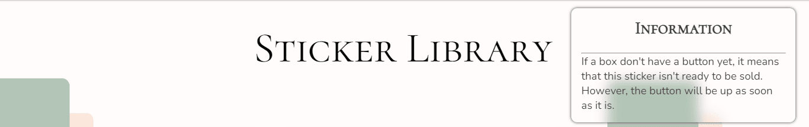
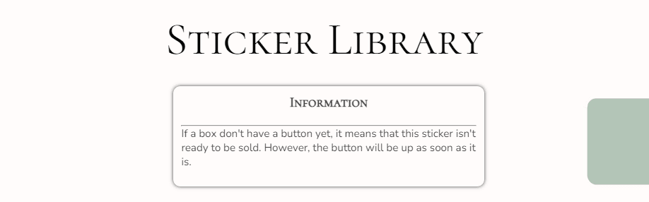
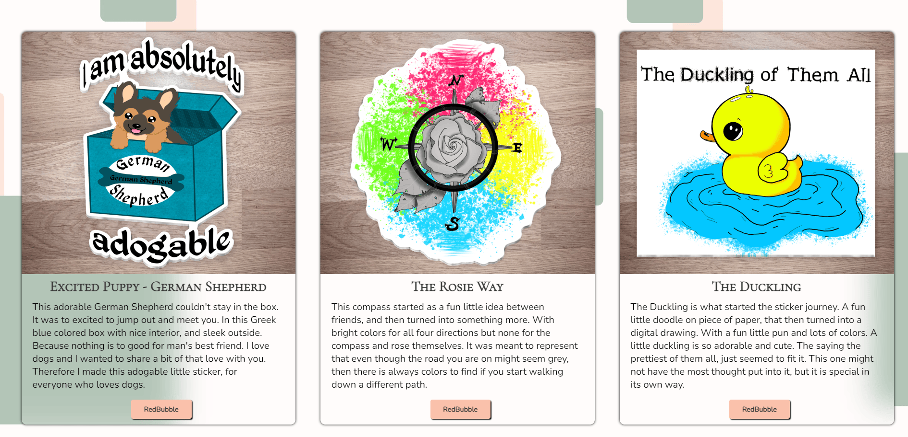
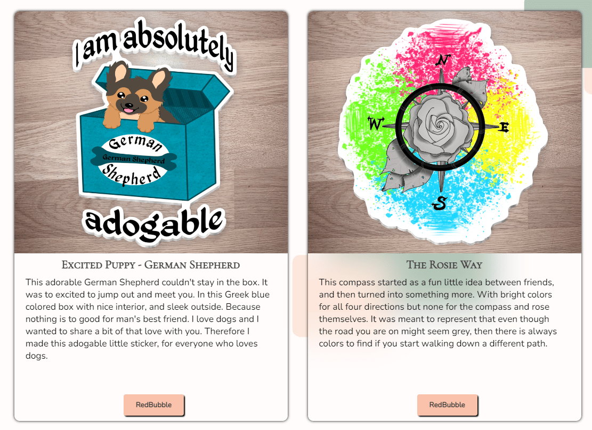
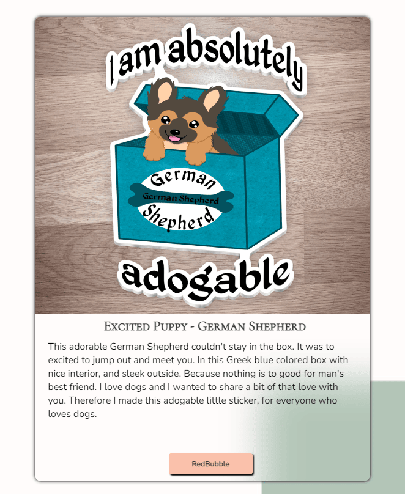
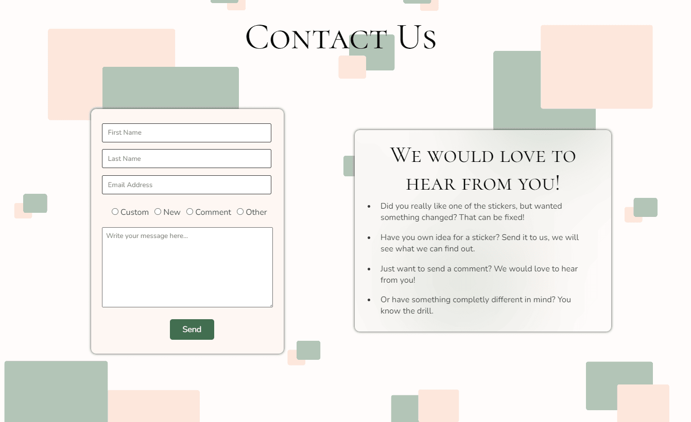

# Lunation Design

## Purpose Of The Project

 

Lunation Design is a full on responsive website that wants to spread the word of the creaters designs. Tell the visiters about the creater and about the stickers they make. The page is targeted towards anyone with a passion and love for stickers as well as puns. There for the website will be usefull for the creater to get their work out in the world while also letting the buyers get closer to the creater themself.

## User Stories

- As a visiting user, I can easily understand the main purpose of the website.
- As a visiting user, I can navigate the website without any problems.
- As a visiting user, I will be able to learn about the product as well as the creater.
- As a visiting user, I would like to contact the artist for business inquiries.

## Features

   ### Existing Features

- __Navigation Bar__
 

   - It is featured on all three pages on the website, the navigation bar is full responsive and it includes Lunation Design logo on the left side, links to the Home page, Stickers page, and Contact page and it is identical on each of the three pages to allow the user easy navigation.
   - The navigation bar allows the user to easily navigate between the pages on the site, across the different devices.
   - If the screen size is 748px or smaller the logo on the left side is not visible.

- __The Landing Page__
   - __Image And Quote__

      - The first half of landing page on all screens includes an image that goes across the top of the screen with a dark overlay and text in the middle, the slogan at the top and some text under it.  
      - The image as well as the text introduces the website of Lunation Design with its slogan and its purpose, it is the first thing the visiter see.  

   - __About__
    
   
      - The bottom of the Landing page includes the about section. In this the visiter on the site get to know a little about the creater behind the stickers.
      - It has the header - About Us - in a box #FAC1AB (Yahoo/light skin color), with a #426E50 (Fairway/green) colored box behind it.
      - It also have three boxes under it that gives the visiter a bit of information on the creater.
         - Who they are and there passion for what they do.
         - How Lunation Design first came to be.
         - What Lunation Design can do for the visiter of the website.
      - The boxes are responsive. On bigger screens the first two boxes are beside each other and the last one is under them and centered. While on smaller screens the three boxes is centered and under each other.

- __Footer__
 
   - It is featured on all three pages on the website just like the navigiation bar, the footer includes the links to the social media that is relevant for this website. All the links opens up on new tabs for the visiters, for easy navigation, and there for no using the "back" button.
   - The main color is #3B3B3B (Dead Pixel/dark grey), with the icons having the color of #FAC1AB (Yahoo/light skin color) and on hover the color of #426E50 (Fairway/green).
   - It is important because the creater wants to reach out to more people, and through the social media links the creater can do that.

- __The Stickers Page__

   - This page is important for the visiters, here they can read about each sticker when the creater post it.
   - It is valuble for the vister because this is the actul selling point.
   - It is easy to navigate and understand which sticker is which, making it more enjoyable for the visiter.
   - With a button on the stickers that are ready to buy, that opens in a new tab to the store where the visiter can buy the sticker.
   - Resonsive on all screens. Going from three beside each other on bigger screens, down to two, and then to one on smaller screens.
   - A header and information box that well inform the visiter of the things they need to know on this page, at the top of the page.

- __The Contact Page__
 
 
   - With this page the visiters will be able to contact the creater, with any inquiries they have.
   - They can write a comment to the creater about if they want there own sticker made, changed one of the already existing stickers, just send a message, or something different. Therefor the visiter will be asked to submit there first and last name, email, and what it is about.
   - There is also a information box about the different options of messeges there is for the visiters.
   - The page is responsive for all sizes. The header is at the top, form and information box starts beside each other on bigger screens and then the form moves under the information box under smaller screens.
   - All boxes and radio buttons are required to be filled for it to be send.
   - The send button works, and send the visiter to the thank you page.

   ### Future Features

## Typography and Color Scheme

- __Typography__

- __Color Scheme__

## Wireframes

__The Landing Page Wireframe__

__The Landing About Page Wireframe__

__The Stickers Page Wireframe__

__The Contact Page Wireframe__

## Technology

   __Technologies Used__

   __Programs Used__

## Testing

   ### code validation
   ### test cases (user story based with screenshots)
   ### fixed bugs
   ### supported screens and browsers

## Deployment

   ### via gitpod
   ### via github pages

## credits
