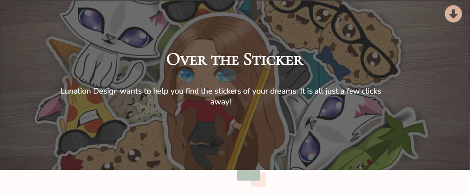
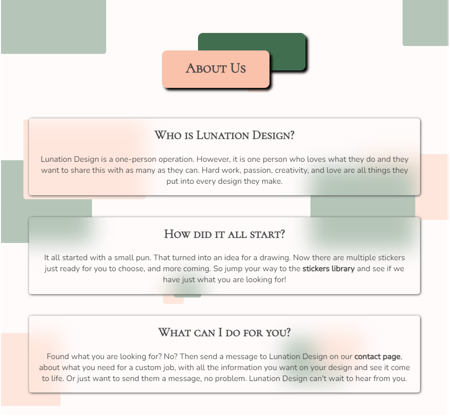

# Lunation Design

Lunation Design is a full on responsive website that wants to spread the word of the creaters designs. Tell the visiters about the creater and about the stickers they make. The page is targeted towards anyone with a passion and love for stickers as well as puns. There for the website will be usefull for the creater to get their work out in the world while also letting the buyers get closer to the creater themself.

 

[The Lunation Design website on Github Pages](https://miarasmussen05.github.io/LunationDesign/)

## User Stories

- As a visiting user, I want to be able to navigate the website to find what I need.
- As a visiting user, I will be able to learn about the product as well as the creater.
- As a visiting user, I would like to contact the artist for business inquiries.
- As a visiting user, I want to know that my business inquiries have been send to the creator.

## Features

   ### Existing Features

- __Favicon__
  - The image used for the favicon on all pages is also the websites logo it creates an cohesion in the over all look of the website. The image is made into a favicon by using 
  [Favicon.io](https://favicon.io/).

  

- __Navigation Bar__
  - It is featured on all three pages on the website, the navigation bar is full responsive and it includes Lunation Design text logo, links to the Home page, Stickers page, and Contact page and it is identical on each of the three pages to allow the user easy navigation.
  - The navigation bar allows the user to easily navigate between the pages on the site, across the different devices.
  - If the screen size is 748px or smaller the logo on the left side shows up in the middle of the Lunation Design text logo in the middle of the page.
 

- __The Home Page__
   - __Image And Quote__
     - The first half of the landing page on all screens includes an image that goes across the top of the screen with a dark overlay and text in the middle, the slogan at the top and some text under it.  
     - The image as well as the text introduces the website of Lunation Design with its slogan and its purpose, it is the first thing the visitor see.
     - The hero image have a transition that moves with the screen width. On desktop and bigger screen sizes the image is moved up under the header to fit the aesthetic of the page size more makign it look smaller. Where on smaller screens it moves back to its original height. The text as well as the about section moves accordingly with the image.

       

   - __About__
     - The bottom of the Landing page includes the about section. In this the visiter on the site get to know a little about the creator behind the stickers.
     - It has the header - About Us - in a box #FAC1AB (Yahoo/light skin color), with a #426E50 (Fairway/green) colored box behind it.
     - It also have three boxes under it that gives the visiter a bit of information on the creator.
        - Who they are and there passion for what they do.
        - How Lunation Design first came to be.
        - What Lunation Design can do for the visiter of the website.
     - The boxes are responsive. On bigger screens the first two boxes are beside each other and the last one is under them and centered. While on smaller screens the three boxes is centered and under each other.
     
       
      

- __Footer__
   - It is featured on all pages on the website just like the navigiation bar, the footer includes the links to the social media that is relevant for this website. All the links opens up on new tabs for the visiters, for easy navigation, and there for no using the "back" button.
   - The main color is #3B3B3B (Dead Pixel/dark grey), with the icons having the color of #FAC1AB (Yahoo/light skin color) and on hover the color of #426E50 (Fairway/green).
   - It is important because the creator wants to reach out to more people, and the social media links makes that possible.
   - On bigger screens the footer have the logo in the middle of the text logo, centered between the social links. Where on smaller screens the logo disapear to create more space.
    
   

- __The Sticker Page__
    - With this page the visitors, can read about each sticker when the creater post it.
    - It is valuble for the vistor because this is the actul selling point.
    - It is easy to navigate and understand which sticker is which, making it more enjoyable for the visiter.
    - With a button on the stickers that are ready to buy, that opens in a new tab to their own store page where the visiter can buy the sticker, and coming soon buttons leading to the store in its whole for the stickers that aren't on the store yet.
    - Resonsive on all screens. Going from three beside each other on bigger screens, down to two, and then to one on smaller screens.
    

- __The Contact Page__
    - With this page the visitors will be able to contact the creator, with any inquiries they have.
    - They can write a comment to the creater about if they want there own sticker made, changed one of the already existing stickers, just send a message, or something different. Therefor the visitor will be asked to submit there first and last name, email, and what it is about.
    - There is also a information box about the different options of messeges there is for the visiters.
    - The page is responsive for all sizes. The header is at the top, form and information box starts beside each other on bigger screens and then the form moves under the information box under smaller screens.
    - All boxes and radio buttons are required to be filled for it to be send.
    - The send button works, and send the visitor to the thank you page if all that is requried has been answered.
     
     

- __Thank You Page__
  - __Thank You Text__
    - The visitor will be send to the thank you page after filling out the form on the contact page and clicking send. 
    - It is to verify the visitor that their message have been send, and will be answered.

     

  - __Response__
    - The thank you page also have information for the visit0r about their messages. In case there is a backlock off messages and they haven't gotten a respond from the creator.
    - The page is to reasure the visiter about their messages even if they haven't gotten an respond.
    - It is responsive for all sizes. With three boxes around an image of the digital drawing of a girl for bigger screens. For smaller screens the three boxes moves under the image and gets centered.
      - No Respond?
      - 48 Hours.
      - Any More Questions?

      

   ### Future Features

   - A future feature could be adding a FAQ page. That way the most asked question could be answered allready on the site instead of the creater having to respond back to multiple people with the same answer.
   - Adding a 5 star rewiew of the stickers, or like button with a heart.
   - Another future feature could be adding a log in for visiters that comes back that have favorite stickers they want to keep. So when logged in you have a library with your favorite stickers.

## Typography and Color Scheme

- __Typography__
   - The logo text as well as headers uses the font of 'Cormorant SC' with a secondary of sans-serif.
   - With a matching font for anything there is not a header is 'Nunito' and secondary of sans-serif.

- __Color Scheme__
   - The color scheme used for Lunation Design is using some welcoming and relxing colours not to sharp, colors that match. Something that will catch the eyes of the visitor but not take away from the stickers that are using sharp bright colors. The color pallet is made by using [Coolors](https://coolors.co/).
   - For the colors of the site there will be used two main colors of #426E50 (Fairway/green) and #FAC1AB (Yahoo/light skin color), with the shades of #fff (white) and #000 (black), #3B3B3B (Dead Pixel/dark grey) and #FCECE4 (Vanilla Blush/very light skin color).

    

## Wireframes

[The Top Of Home Page - Image And Quote - Wireframe](./READMEimages/wireframes/1TopOfHomePage.png) 

[The Bottom Of Home Page - About - Wireframe](./READMEimages/wireframes/2BottomOfHomePage.png)

[The Sticker Page Wireframe](./READMEimages/wireframes/3StickersPage.png)

[The Contact Page Wireframe](./READMEimages/wireframes/4ContactPage.png)

[The Top Of Thanks Page - Thank You Text - Wireframe](./READMEimages/wireframes/5TopOfThanksPage.png)

[The Bottom Of Thanks Page - Response - Wireframe](./READMEimages/wireframes/6BottomOfThanksPage.png)

## Technology

   __Technologies Used__

   - HTML
   - CSS
   - JavaScript

   __Programs Used__

   - Git - Was used for version control, the Gitpod terminal to commit and push to Github.

   - [Github](https://github.com/) - Was used to store the project code and display the project in Github Pages.

   - Balsamiq - is an app that was used to create the wireframes.

   - [Comoressor](https://compressor.io/) - Was used for compressing images to a smaller size.

   - [Coolors](https://coolors.co/) - Was used for creating a pallet of the colors used.

   - [Am I Responsive?](https://ui.dev/amiresponsive?) - Was used for having an image of the website on all sizes.
   
   - [BIRME](https://www.birme.net) - Was used to changing the images from png/jpeg to webp.

   - [Font Awesome](https://fontawesome.com/) - Was used to add icons for the social links in the footer.

   - Google Dev Tools- Where used to test and troubleshoot the webpage as well as fix problems with responsive design and styling.

   - [Google Fonts](https://fonts.google.com/) - Where used to import every font used in the website.

   - [Shields](https://shields.io/) - Was used to add different shields into the README. 

   - [Favicon](https://favicon.io/) - Was used to take the logo and make it into a favicon.

## Testing

  - __Troubleshooting & peer code review__

    Testing have been going on thought out the building of this website. Using google dev tools to test and toubleshoot as I was going along with every step. Asking others to test out if it was easy to understand and follow the flow of the page.

  When I brought it up on slack for peer code review I got a few things back:
   - Wozza_5P pointed out to me that having the information box on sticker page wasn't the best user experince, that it seemed off having only 3 buttons and the rest having none.
   - Wozza_5P also pointed out that my 'only more questions?' box on the thanks page was hard to understand, and instead would be better with 'any more questions?'.
   - The same with the box for '48-72 hours', how it would be better to just choose one instead of having both of them on it.
   - Sean Finn also had a look over and pointed out a flow mistake in bottom of the last card on the sticker page. On the smaller screens it would stand on top of the footer when you where at the bottom instead of having some margin.

   ### code validation
   
   Validating the code on this project I used [W3C Nu Html Checker](https://validator.w3.org/), [W3C CSS Validation Service](https://jigsaw.w3.org/css-validator/), and [JSHint](https://jshint.com/).

   - [HTML validator for home page](./READMEimages/testing/validator/w3cIndex.PNG)

   - [HTML validator for sticker page](./READMEimages/testing/validator/w3cStickers.PNG)

   - [HTML validator for contact page](./READMEimages/testing/validator/w3cContact.PNG)

   - [HTML validator for thanks page](./READMEimages/testing/validator/w3cThanks.PNG)

   - [CSS validator for style.css file](./READMEimages/testing/validator/w3cCSS.PNG)

   - [JS validator for JS code on sticker page](./READMEimages/testing/validator/jsHint.PNG)

   ### Lighthouse

   On google when using dev tools there is a program that test the performance, accessibility, best practices and SEO from 1-100. Using this I check each page both for desktop and mobile use to get each number. 

   - __The home page lighthouse testing - desktop ~ mobile__

   

   

   - __The Sticker page lighthouse testing - desktop ~ mobile__

   

   

   - __The Contact page lighthouse testing - desktop ~ mobile__

   

   

   - __The Thanks page lighthouse testing - desktop ~ mobile__

   

   
   
   ### test cases (user story based with screenshots)

   - ### As a visiting user, I can easily understand the main purpose of the website.
   - ### As a visiting user, I can navigate the website without any problems.
    

   - ### As a visiting user, I will be able to learn about the product as well as the creater.
   
   

   - ### As a visiting user, I would like to contact the artist for business inquiries.
    

   ### Bugs
   - 
      - On apple products the button on the bottom of the sticker boxes move to the same position at the top of the page, when in position absolute. This however, I couldn't find a solution to.

      
      - On the browser firefox the buttons from the sticker page move one step to the right and leave the page.

   ### fixed bugs
   - 
      - On apple products the text on the sticker page moved to be up at the top from all the boxes becouse it was put in absolute position. This was fixed
      by removing absolut postion for the text information and put display inline-grid for all the whole sticker boxes. '

      ### Supported screens and browers

      #### Screens
      - The website has responsive design with multiple media queries.
      - Normal desktop
      - 1280px wide and down
      - 992px wide and down
      - 748px wide and down
      - 548px wide and down until 280px.
         
      #### Browers on computer and phone
      - Google chrome: Works perfectly unless on apple products where button on sticker page dosen't work.
      - Microsoft Edge: Works perfectly.
      - Firefox: Backdrop filter isn't suppoerted but the website still looks great without it. The buttons on the sticker page also acts up here. However, they are moved to the side and not moved to the top as on apple products.
      
      - Safari: Works great other then the button on sticker page.
      - Iphone 4: Works great other then the button on sticker page.
      - Iphone 5 SE: Works great other then the button on sticker page.
      - Iphone SE: Works great other then the button on sticker page.
      - Samsung phone: Works perfectly.
      - Huawei phone: Works perfectly.

## Deployment

   ### via gitpod
   - Write in the terminal.
   - git add .
   - git commit -m ""
   - In the commit you write a commit that will tell what you just did in the code.
   - git push
   - Now the saved code you just made have been pushed to your git hub repositori. 

   ### via github pages
   - Log in to Github.
   - Go to the repositories.
   - Then take this project LunationDesign.
   - Go to the settings link.
   - Then click on the pages link that is found on the navigations bar on the left side.
   - Check the source section on the page, and choose main instead of none.
   - Then click Save. After a few minutes you can see your live Github pages site is now deployed and the URL shown at the top of the page.

## Credits

### Code Used
- Tutor Assistance Sean for the JS on sticker note: Sticky header.

### Content 
- All images, logo, and text have been made and written by me.
