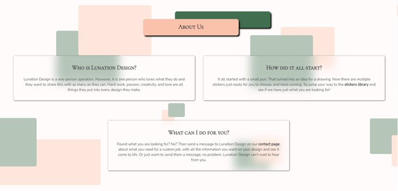
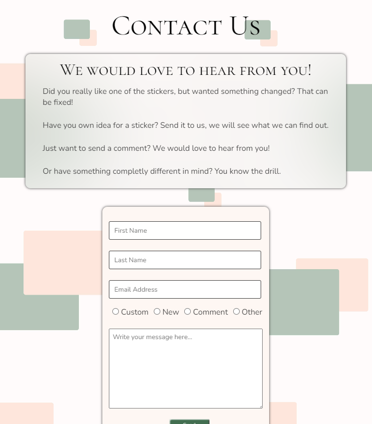
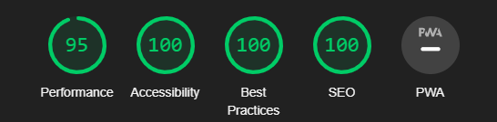

# Lunation Design

Lunation Design is a full on responsive website that wants to spread the word of the creators designs. Tell the visitors about the creator and about the stickers they make. The page is targeted towards anyone with a passion and love for stickers as well as puns. There for the website will be useful for the creator to get their work out in the world while also letting the buyers get closer to the creator themselves.

 

[The Lunation Design website on GitHub Pages](https://miarasmussen05.github.io/LunationDesign/)

## Contents

- [User Stories](#user-stories)

- [Features](#features)
  - [Existing Features](#existing-features)
  - [Future Features](#future-features)

- [Typography and Color Scheme](#typography-and-color-scheme)
  - [Typography](#typography)
  - [Color Scheme](#color-scheme)

- [Wireframes](#wireframes)

- [Technology](#technology)
  - [Technologies Used](#technologies-used)
  - [Programs Used](#programs-used)

- [Testing](#testing)
  - [Troubleshooting & peer code review](#troubleshooting--peer-code-review)
  - [Code validation](#code-validation)
  - [Lighthouse](#lighthouse)
  - [Test cases](#test-cases)
  - [Fixed bugs](#fixed-bugs)
  - [Supported screens and browsers and full testing](#supported-screens-and-browsers-and-full-testing)

- [Deployment](#deployment)

- [Credits](#credits)
  - [Code Used](#code-used)
  - [Content](#content)
  - [Honourable mentions](#honourable-mentions)

## User Stories

- As a visiting user, I want to be able to navigate the website to find what I need.
- As a visiting user, I will be able to learn about the product as well as the creator.
- As a visiting user, I would like to contact the artist for business inquiries.
- As a visiting user, I want to know that my business inquiries have been send to the creator.

## Features

   ### Existing Features

- __Favicon__
  - The image used for the favicon on all pages is also the websites logo it creates an cohesion in the over all look of the website. The image is made into a favicon by using 
  [Favicon.io](https://favicon.io/).

  

- __Navigation Bar__
  - It is featured on all three pages on the website, the navigation bar is full responsive and it includes Lunation Design text logo, links to the Home page, Stickers page, and Contact page and it is identical on each of the three pages to allow the user easy navigation.
  - The navigation bar allows the user to easily navigate between the pages on the site, across the different devices.
  - If the screen size is 748px or smaller the logo on the left side shows up in the middle of the Lunation Design text logo in the middle of the page.
 

- __The Home Page__
   - __Image And Quote__
     - The first half of the landing page on all screens includes an image that goes across the top of the screen with a dark overlay and text in the middle, the slogan at the top and some text under it.  
     - The image as well as the text introduces the website of Lunation Design with its slogan and its purpose, it is the first thing the visitor see.
     - The hero image have a transition that moves with the screen width. On desktop and bigger screen sizes the image is moved up under the header to fit the aesthetic of the page size more making it look smaller. Where on smaller screens it moves back to its original height. The text as well as the about section moves accordingly with the image.

       

   - __About__
     - The bottom of the Landing page includes the about section. In this the visitor on the site get to know a little about the creator behind the stickers.
     - It has the header - About Us - in a box #FAC1AB (Yahoo/light skin color), with a #426E50 (Fairway/green) colored box behind it.
     - It also have three boxes under it that gives the visitor a bit of information on the creator.
        - Who they are and there passion for what they do.
        - How Lunation Design first came to be.
        - What Lunation Design can do for the visitor of the website.
     - The boxes are responsive. On bigger screens the first two boxes are beside each other and the last one is under them and centred. While on smaller screens the three boxes is centred and under each other.
     
       
      

- __Footer__
   - It is featured on all pages on the website just like the navigation bar, the footer includes the links to the social media that is relevant for this website. All the links opens up on new tabs for the visitors, for easy navigation, and there for no using the "back" button.
   - The main color is #3B3B3B (Dead Pixel/dark grey), with the icons having the color of #FAC1AB (Yahoo/light skin color) and on hover the color of #426E50 (Fairway/green).
   - It is important because the creator wants to reach out to more people, and the social media links makes that possible.
   - On bigger screens the footer have the logo in the middle of the text logo, centred between the social links. Where on smaller screens the logo disappear to create more space.
    
   

- __The Sticker Page__
    - With this page the visitors, can read about each sticker when the creator post it.
    - It is valuable for the visitor because this is the actual selling point.
    - It is easy to navigate and understand which sticker is which, making it more enjoyable for the visitor.
    - With a button on the stickers that are ready to buy, that opens in a new tab to their own store page where the visitor can buy the sticker, and coming soon buttons leading to the store in its whole for the stickers that aren't on the store yet.
    - Responsive on all screens. Going from three beside each other on bigger screens, down to two, and then to one on smaller screens.
    

- __The Contact Page__
    - With this page the visitors will be able to contact the creator, with any inquiries they have.
    - They can write a comment to the creator about if they want there own sticker made, changed one of the already existing stickers, just send a message, or something different. Therefor the visitor will be asked to submit there first and last name, email, and what it is about.
    - There is also a information box about the different options of messages there is for the visitors.
    - The page is responsive for all sizes. The header is at the top, form and information box starts beside each other on bigger screens and then the form moves under the information box under smaller screens.
    - All boxes and radio buttons are required to be filled for it to be send.
    - The send button works, and send the visitor to the thank you page if all that is required has been answered.
     
     

- __Thank You Page__
  - __Thank You Text__
    - The visitor will be send to the thank you page after filling out the form on the contact page and clicking send. 
    - It is to verify the visitor that their message have been send, and will be answered.

     

  - __Response__
    - The thank you page also have information for the visit0r about their messages. In case there is a back lock off messages and they haven't gotten a respond from the creator.
    - The page is to reassure the visitor about their messages even if they haven't gotten an respond.
    - It is responsive for all sizes. With three boxes around an image of the digital drawing of a girl for bigger screens. For smaller screens the three boxes moves under the image and gets centred.
      - No Respond?
      - 48 Hours.
      - Any More Questions?

      

   ### Future Features

   - A future feature could be adding a FAQ page. That way the most asked question could be answered already on the site instead of the creator having to respond back to multiple people with the same answer.
   - Adding a 5 star review of the stickers, or like button with a heart.
   - Another future feature could be adding a log in for visitors that comes back that have favourite stickers they want to keep. So when logged in you have a library with your favourite stickers.

## Typography and Color Scheme

  ### Typography
   - The logo text as well as headers uses the font of 'Cormorant SC' with a secondary of sans-serif.
   - With a matching font for anything there is not a header is 'Nunito' and secondary of sans-serif.

  ### Color Scheme
   - The color scheme used for Lunation Design is using some welcoming and relaxing colours not to sharp, colors that match. Something that will catch the eyes of the visitor but not take away from the stickers that are using sharp bright colors. The color pallet is made by using [Coolors](https://coolors.co/).
   - For the colors of the site there will be used two main colors of #426E50 (Fairway/green) and #FAC1AB (Yahoo/light skin color), with the shades of #fff (white) and #000 (black), #3B3B3B (Dead Pixel/dark grey) and #FCECE4 (Vanilla Blush/very light skin color).

   

## Wireframes

[The Top Of Home Page - Image And Quote - Wireframe](./READMEimages/wireframes/1TopOfHomePage.png) 

[The Bottom Of Home Page - About - Wireframe](./READMEimages/wireframes/2BottomOfHomePage.png)

[The Sticker Page Wireframe](./READMEimages/wireframes/3StickersPage.png)

[The Contact Page Wireframe](./READMEimages/wireframes/4ContactPage.png)

[The Top Of Thanks Page - Thank You Text - Wireframe](./READMEimages/wireframes/5TopOfThanksPage.png)

[The Bottom Of Thanks Page - Response - Wireframe](./READMEimages/wireframes/6BottomOfThanksPage.png)

## Technology

   ### Technologies Used

   - HTML
   - CSS
   - JavaScript

   ### Programs Used

   - Git - Was used for version control, the Gitpod terminal to commit and push to GitHub.

   - [GitHub](https://github.com/) - Was used to store the project code and display the project in GitHub Pages.

   - Balsamiq - is an app that was used to create the wireframes.

   - [Comoressor](https://compressor.io/) - Was used for compressing images to a smaller size.

   - [Coolors](https://coolors.co/) - Was used for creating a pallet of the colors used.

   - [Am I Responsive?](https://ui.dev/amiresponsive?) - Was used for having an image of the website on all sizes.
   
   - [BIRME](https://www.birme.net) - Was used to changing the images from png/jpeg to webp.

   - [Font Awesome](https://fontawesome.com/) - Was used to add icons for the social links in the footer.

   - Google Dev Tools- Where used to test and troubleshoot the webpage as well as fix problems with responsive design and styling.

   - [Google Fonts](https://fonts.google.com/) - Where used to import every font used in the website.

   - [Shields](https://shields.io/) - Was used to add different shields into the README. 

   - [Favicon](https://favicon.io/) - Was used to take the logo and make it into a favicon.

## Testing

  ### Troubleshooting & peer code review

  Testing have been going on thought out the building of this website. Using google dev tools to test and troubleshoot as I was going along with every step. Asking others to test out if it was easy to understand and follow the flow of the page.

  When I brought it up on slack for peer code review I got a few things back:
   - Wozza_5P pointed out to me that having the information box on sticker page wasn't the best user experience, that it seemed off having only 3 buttons and the rest having none.
   - Wozza_5P also pointed out that my 'only more questions?' box on the thanks page was hard to understand, and instead would be better with 'any more questions?'.
   - The same with the box for '48-72 hours', how it would be better to just choose one instead of having both of them on it.
   - Sean Finn also had a look over and pointed out a flow mistake in bottom of the last card on the sticker page. On the smaller screens it would stand on top of the footer when you where at the bottom instead of having some margin.

   ### Code validation
   
   Validating the code on this project I used [W3C Nu Html Checker](https://validator.w3.org/), [W3C CSS Validation Service](https://jigsaw.w3.org/css-validator/), and [JSHint](https://jshint.com/).

   - [HTML validator for home page](./READMEimages/testing/validator/w3cIndex.PNG)

   - [HTML validator for sticker page](./READMEimages/testing/validator/w3cStickers.PNG)

   - [HTML validator for contact page](./READMEimages/testing/validator/w3cContact.PNG)

   - [HTML validator for thanks page](./READMEimages/testing/validator/w3cThanks.PNG)

   - [CSS validator for style.css file](./READMEimages/testing/validator/w3cCSS.PNG)

   - [JS validator for JS code on sticker page](./READMEimages/testing/validator/jsHint.PNG)

   ### Lighthouse

   On google when using dev tools there is a program that test the performance, accessibility, best practices and SEO from 1-100. Using this I check each page both for desktop and mobile use to get each number. 

   - __The home page lighthouse testing - desktop ~ mobile__

   

   

   - __The Sticker page lighthouse testing - desktop ~ mobile__

   

   

   - __The Contact page lighthouse testing - desktop ~ mobile__

   

   

   - __The Thanks page lighthouse testing - desktop ~ mobile__

   

   
   
   ### Test cases

   - __As a visiting user, I want to be able to navigate the website to find what I need__
     - The header is at the top of the page on all pages, it is the same on all pages across. This is to secure that there is no surprises for the visitors as well as make it easy to navigate the site. The header on the sticker page is sticky when you scroll down to make it easier for visitor to move to another page without having to scroll all the way back up again.
        
       

   - __As a visiting user, I will be able to learn about the product as well as the creator__
     - On the sticker page the visitor can read about each sticker inside their own card under the image. Each sticker have gotten its own story. On the bottom of the home page in the about section is where the visitor will be able to learn a little more about the creator themselves. 

       
        

   - __As a visiting user, I would like to contact the artist for business inquiries__
     - The contact page have a form with three input sections where the visitor have to write their first name, last name, and email addressee. Then there is four radio buttons to choose from, for just the inquiries the visitor could have. And after the text area have been answered the message is ready to be send of to the creator by clicking the send button at the bottom of the form.

       

   - __As a visiting user, I want to know that my business inquiries have been send to the creator__
     - As soon as the visitor have clicked the send button on the contact page they will be redirected to the thanks page. Here at the top of the page there is a thank you note to reassure the visitor that their message have been send and that the creator will respond as soon as possible. 

       

   ### Fixed bugs

   - On apple products the text on the sticker page moved to be up at the top from all the boxes because it was put in absolute position. This was fixed
      by removing absolute position for the text information and put display inline-grid for all the sticker boxes.

      

   - On apple products the button on the bottom of the sticker boxes would move to the same position at the top of the page, when in position absolute. This was fixed by wrapping the button around an a tag and styling it there after. 

      

   - On the browser Firefox the buttons from the sticker page would move one step to the right and the third button would leave the page. This was fixed by wrapping the button around an a tag and styling it there after.

      

   - But by fixing the button problem and Firefox problem by wrapping the button around an a tag it made a validation error instead. which was fixed by changing the button element out with a div to wrap around the a tag.

      ### Supported screens and browsers and full testing

      __Screens__
        - The website has responsive design with multiple media queries.
          - Normal desktop
          - 1280px wide and down
          - 992px wide and down
          - 748px wide and down
          - 548px wide and down until 280px.
         
      __Browsers on computer and phone__
        - The website has been checked on multiple browsers and phones.
          - Google chrome
          - Microsoft Edge
          - Firefox: Backdrop filter isn't supported but the website still works without it.
          - Safari
          - iPhone 4
          - iPhone 5 SE
          - iPhone SE
          - Samsung phone
          - Huawei phone

      __Full testing__

       - All these devices and browsers has also tested if everything works.
         - On each page every linked where it was supposed and worked they it should for internal links in the page. For all external links on all pages opened in a new tab to the page they where meant to go to.
           
       - The same went for the form. 
           1. Trying to submit the form without touching anything inside. Making the form react and tell that the name input needs to be filled. 
           2. Trying again to submit the form, it again reacted and pointed out that the last name input field had not been filled.
           3. Again the form was submitted and again it reacted towards the empty email address input field.
           4. Clicking the send button again after filling out the three input section, but again then form showed that we also have to choose a radio button.
           5. This now being selected the send button was clicked again, and just as it was supposed to it reacted and pointed out the text area was missing.
           6. After everything had either been chosen or filled out, the send button was clicked again this time the form send me on to the thanks page.
           7. This was tried in multiple different combinations and each time the form would react if not everything had been filled and if not one of the radio buttons had been chosen.  

## Deployment

  - __via gitpod__
    - Log into GitHub.
    - Make a repository
    - Click the green button close to the top of the page that says Gitpod.
    - After letting Gitpod load an alert pops up on the top of the screen, click cancel.
    - Then click the button that says More Actions.
    - Hereafter click Open in Browser.
    - Now right click with your mouse over the big box on the left that has your repository name over it.
    - Click new file.
    - Then make an index.html file. 
    - Go to the top of the index file and click ! and enter. This will make a start template.
    - Make a basic structure for your index page.
    - Click on terminal at the bottom of the page.
    - write 'git add .'
    - Then for your first commit write 'git commit -m "Initial commit".
    - Hereafter write 'git push'.
    - Your code have now been pushed back and saved on your GitHub repository.

  - __via GitHub pages__
    - Log into GitHub.
    - Go to the repositories.
    - Then take this project LunationDesign.
    - Go to the settings link.
    - Then click on the pages link that is found on the navigations bar on the left side.
    - Check the source section on the page, and choose main instead of none.
    - Then click Save. After a few minutes you can see your live GitHub pages site is now deployed and the URL shown at the top of the page.

## Credits

### Code Used
- Tutor Assistance Sean for the JS on sticker note: The Sticky header.

### Content 
- All images, social media profiles, logo, and text have been made and written by me.

### Honourable mentions
- Tutor Assistance Sean for making the sticky header.
- [Chris Williams/Chris_Williams_5P](https://github.com/Chr15w1986) for spending an hour trying to help me with the first problem with the buttons.
- Tutor Assistance Rebecca for helping me to get where the buttons wasn't a problem and neither a validator error.
- [Warwick Hart/Wozza_5P](https://github.com/BobWritesCode) for taking time out of his day to look over my website and give me his honest opinion and even find some spelling errors, after I put it on peer code review.
- [Sean Finn](https://github.com/seanf316) for taking time out of his day and looking over the website looking for mistakes, after I put it on peer code review.
- My mentor Rohit Sharma for keeping me on track and helping me understand and see the mistakes I had made.
- [Bogdan/Bogdan_5P](https://github.com/Bogdan933) for taking his time to listen and go back and forth on my ideas for both header and footer.
